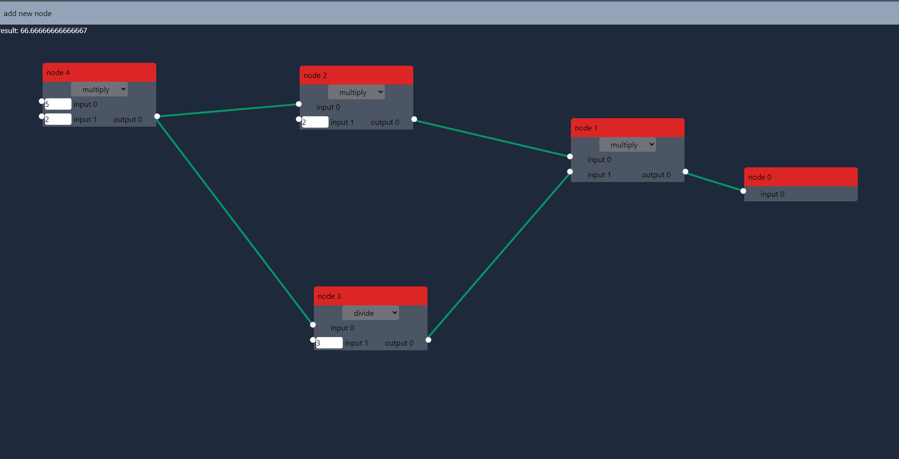

# Basic node/graph based calculator 

a node can be generate by clicking on the "add node text".

To conenct 2 nodes, you first click on the output circle and then on the input circle. Now a line will appear. 

At this moment, the programm does not prevent reccursive node structures and it will crash when you try to connect a child node back into the input of its parrent. 

Changing the values will update the result, which is displayed in the top left corner. 